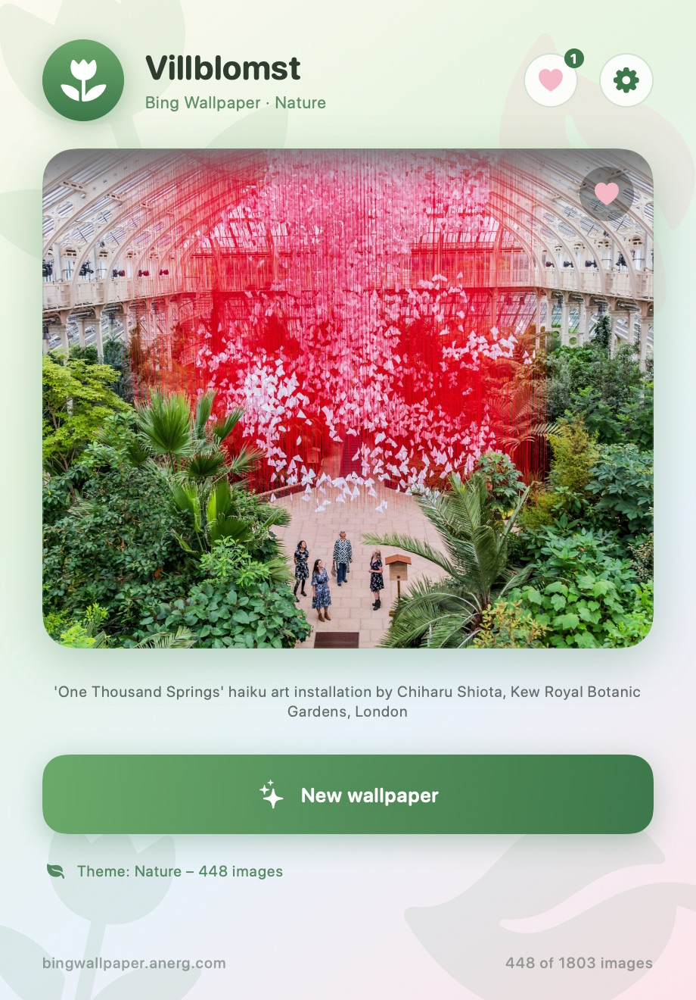
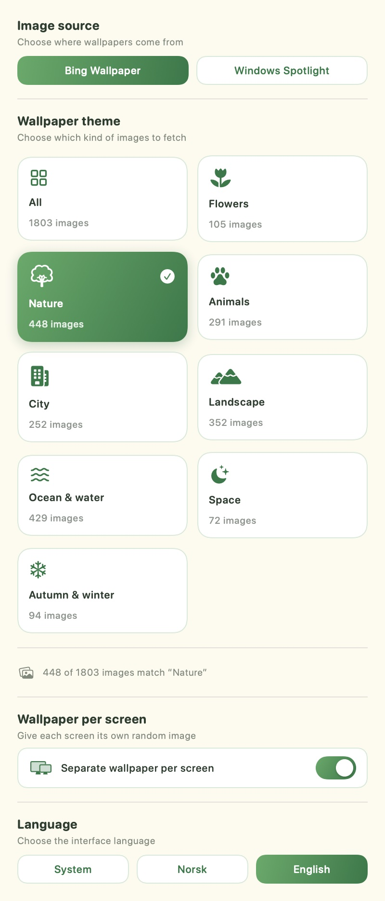
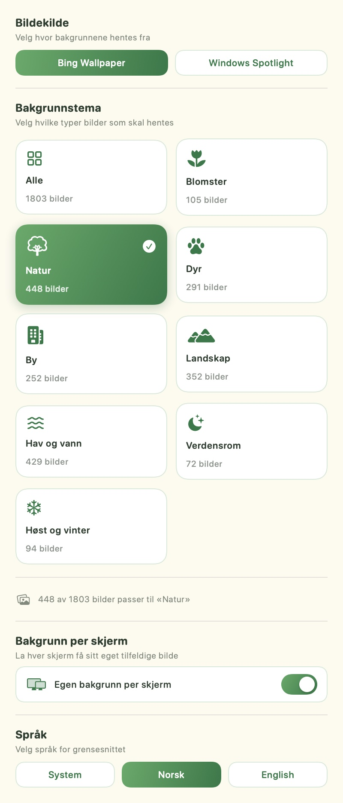

# Villblomst

A small native macOS app that downloads a random 4K wallpaper from
[Bing Wallpaper Archive](https://bingwallpaper.anerg.com/) and sets it as your
desktop background with a single click.

<p align="center">
  
  
</p>

## Features

- **Two 4K image sources** – the Bing Wallpaper Archive and Windows Spotlight,
  both downloaded at full 3840x2160 resolution.
- **Theme picker** – choose which kind of images to fetch (flowers, nature,
  animals, city, landscape, ocean, space, autumn/winter, or everything).
- **Bilingual interface** – Norwegian and English, switchable at runtime with a
  system-language default.
- **Favorites** – save the wallpapers you like and re-apply them any time.
- **Multiple screens** – optionally give each screen its own random wallpaper, or
  assign a saved favorite to a specific screen.
- **Sets the desktop background** on every connected screen via `NSWorkspace`.
- **Remembers your theme** and keeps a local collection of ~1800 wallpapers,
  refreshed automatically every 7 days.
- **Light wildflower/plant UI theme** with a custom generated app icon.
- **No third-party dependencies** – pure SwiftUI/AppKit, built with `swiftc`.

## Requirements

- macOS 13 or later
- Xcode Command Line Tools (`xcode-select --install`)

## Build and run

```bash
git clone https://github.com/oddhap/Villblomst.git
cd Villblomst
./build.sh
open Villblomst.app
```

`build.sh` generates the app icon, compiles the sources, assembles
`Villblomst.app`, and signs it ad-hoc. Because the app is unsigned (no Apple
Developer certificate), Gatekeeper may ask you to confirm the first launch.

## Usage

1. Open `Villblomst.app`.
2. Click **Ny bakgrunn** (*New background*) to fetch and apply a random wallpaper.
3. Click the gear icon (or press `Cmd+,`) to open **Settings**, then pick an
   image source and a theme.
4. Scroll to the **Language** section in Settings to switch between System,
   Norsk, and English.
5. Tap the heart on the preview to add the current wallpaper to **Favorites**.
   Open the heart button in the toolbar to re-apply or remove saved wallpapers.
6. With more than one display, turn on **Wallpaper per screen** in Settings to
   fetch a separate image for each screen, and use the display button on a
   favorite to assign it to a specific screen.
7. The current image and its caption are shown in the preview card.

Themes are matched against the wallpaper's caption text, so several themes can
overlap. Approximate distribution of the built-in archive:

| Theme           | Wallpapers |
| --------------- | ---------: |
| Alle (All)      |       1803 |
| Natur (Nature)  |        448 |
| Hav og vann     |        429 |
| Landskap        |        352 |
| Dyr (Animals)   |        291 |
| By (City)       |        252 |
| Blomster        |        105 |
| Høst og vinter  |         94 |
| Verdensrom      |         72 |

## Image sources

### Bing Wallpaper Archive

1. `Scraper` fetches monthly archive pages (`/archive/us/yyyyMM`) and collects
   every wallpaper entry (slug + caption).
2. The pool is filtered by the selected theme using keyword matching on the
   caption.
3. For the chosen wallpaper, the detail page (`/detail/us/<slug>`) is fetched and
   the **Download 4K** link is extracted with a regular expression.
4. The image is downloaded to
   `~/Library/Application Support/Villblomst/` and applied with
   `NSWorkspace.shared.setDesktopImageURL(_:for:options:)`.

The wallpaper pool is cached in
`~/Library/Application Support/Villblomst/pool.json` for 7 days.

### Windows Spotlight

`SpotlightSource` calls Microsoft's Spotlight selection API
(`fd.api.iris.microsoft.com/v4/api/selection`) with the system region and
locale, and asks for landscape images. It requests a few batches, filters them by
the selected theme, and downloads the chosen image directly at 3840x2160. No
archive caching is needed because the API returns a fresh batch on every request.

## Project structure

```
Sources/
  VillblomstApp.swift    App entry point and Settings scene
  ContentView.swift      Main window UI and light wildflower theme
  SettingsView.swift     Theme picker and language selector
  FavoritesView.swift    Saved wallpapers panel
  WallpaperStore.swift   State, caching, download and wallpaper handling
  Scraper.swift          Bing archive scraping and 4K URL extraction
  SpotlightSource.swift  Windows Spotlight API client
  Themes.swift           Theme definitions and keyword matching
  Localization.swift     Norwegian/English strings and language handling
Tools/
  makeicon.swift         Generates the AppIcon.iconset at build time
Info.plist               App bundle metadata
build.sh                 One-step build script
docs/                    Screenshots used in this README
```

## Language

The interface ships with Norwegian and English. The default follows the macOS
system language (`Locale.preferredLanguages`), and you can override it with the
selector at the bottom of the Settings panel. The choice is stored in
`UserDefaults` and applied immediately without restarting the app.

<p align="center">
  
</p>

## Favorites

Tap the heart on the preview card to save the current wallpaper. Saved
wallpapers appear under the heart button in the toolbar, where you can re-apply
them as the desktop background or remove them. Favorites are stored in
`~/Library/Application Support/Villblomst/favorites.json`, and the local image
files are kept so a favorite can be re-applied without downloading it again.

## Multiple screens

Turn on **Wallpaper per screen** in Settings: each press of **New wallpaper**
then fetches a separate random image for every connected display. You can also
open Favorites and use the display button on a tile to assign that wallpaper to a
specific screen; the assigned screen numbers are shown under the tile. Screen
assignments are stored in
`~/Library/Application Support/Villblomst/screens.json`.

## Acknowledgements

The Windows Spotlight integration is based on the API research and
implementation in [ORelio/Spotlight-Downloader](https://github.com/ORelio/Spotlight-Downloader),
which is released under [CDDL-1.0](https://opensource.org/licenses/CDDL-1.0).
Thanks to ORelio for documenting the Spotlight API endpoints.

## Notes and disclaimer

- The app is not sandboxed, since setting the desktop picture and writing to
  Application Support from a sandboxed process is restricted.
- All wallpapers are copyright their respective owners and are provided by the
  Bing Wallpaper Archive and by Microsoft Windows Spotlight. This project only
  automates downloading them for personal use; it does not claim any rights to
  the images.

## License

The source code is released under the [MIT License](LICENSE).
